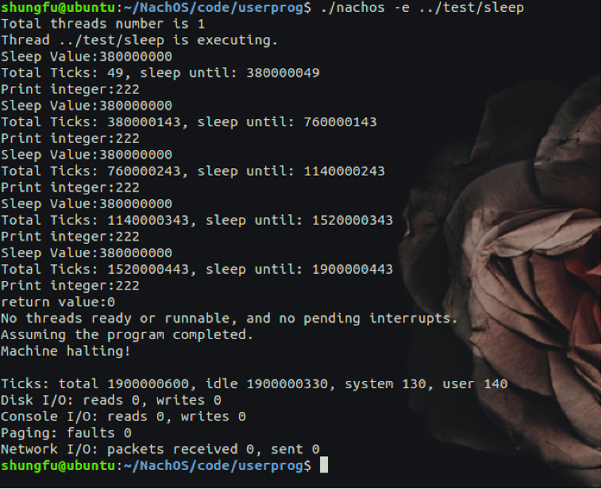
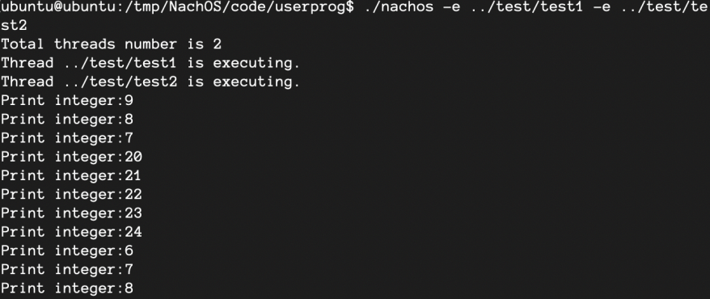
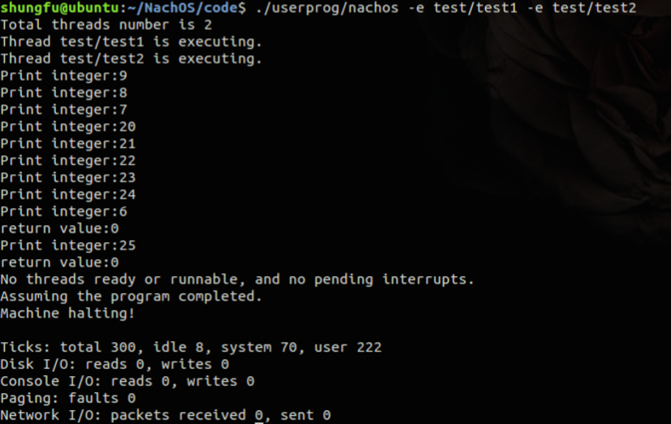
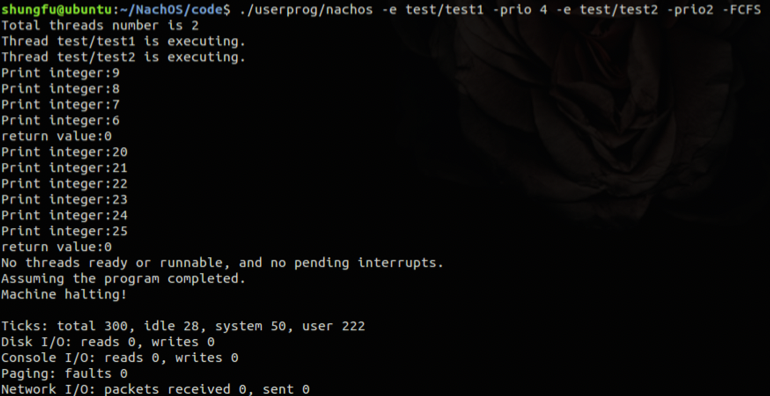
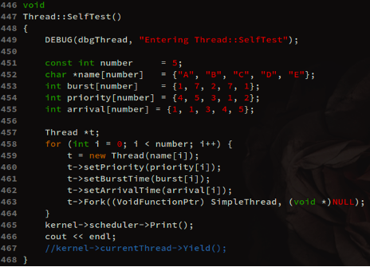
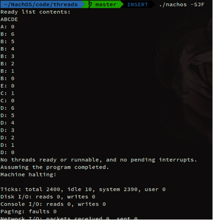
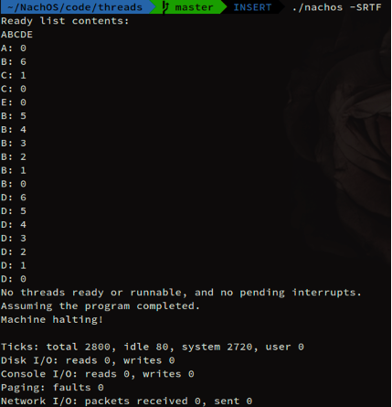
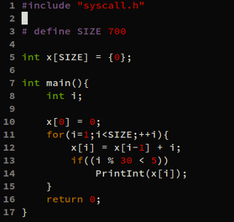
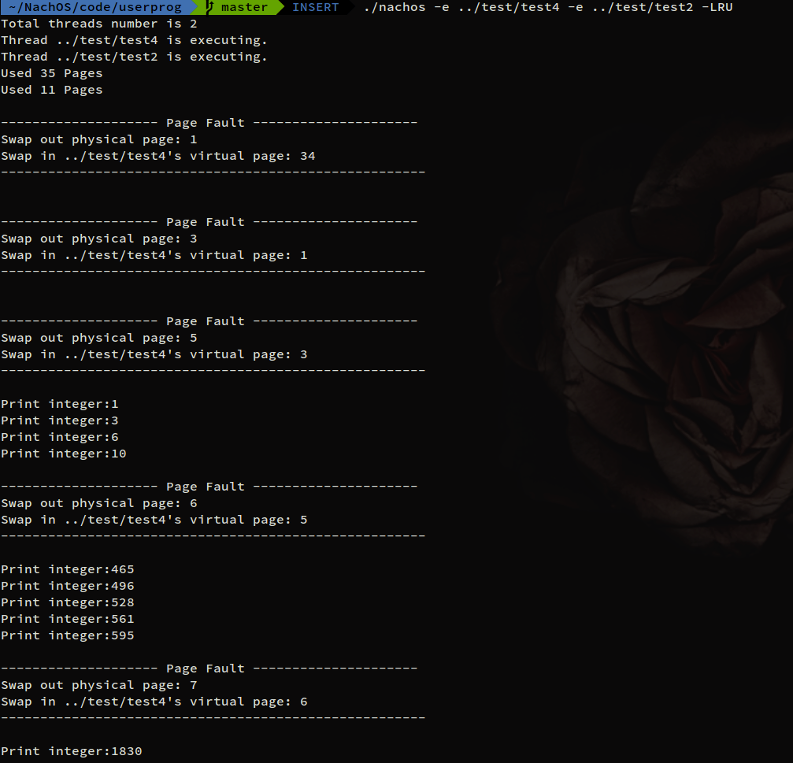

# OS project for Nachos 4.0.
> Nachos 4.0 is somewhat of a re-write of Nachos 3.4.

NachOS 是一個教學用的作業系統，內容有很多未實作完成的功能，透過完成並修正錯誤來練習了解一個作業系統的實作流程。

下面列出各 project 的功能以及結果，詳細的實作內容可以查看 <code>Reports</code>。

# Project 1 - Implement Syscall Sleep
了解 SYSCALL 流程並完成 SYSCALL sleep。

# Project 2 - CPU schedular
原先的 NachOS 載入兩個程式後，會覆蓋相同的 code segment，因此需要為實體記憶體位址做一些轉換，實現 multi-programming (multi-thread)。

記憶體產生衝突的程式碼主要在 code/userprog/addrspace.cc。

錯誤範例圖如下，\
test1 從 9 往下遞減，test2 從 20 網上遞增，但是下圖可以看test1 切到 test2 後再切回後也變成遞增了。

需要完成的 CPU Schedular 如下：
- 修正上述衝突
- FCFS
- SJF
- SRTF

## Code Segment 修正結果

## FCFS

## 測試程式 for SJF & SRTF

| SJF | SRTF |
| ---- | ---- |
|  |  |

# Project 3 - Virtual Memory

實現 virtual meory 並可以處理 page fault。\
實作 Page Replacement Algorithm 的 FIFO 與 LRU。

## 測試程式

| FIFO | LRU |
| ---- | --- |
|  |  |
